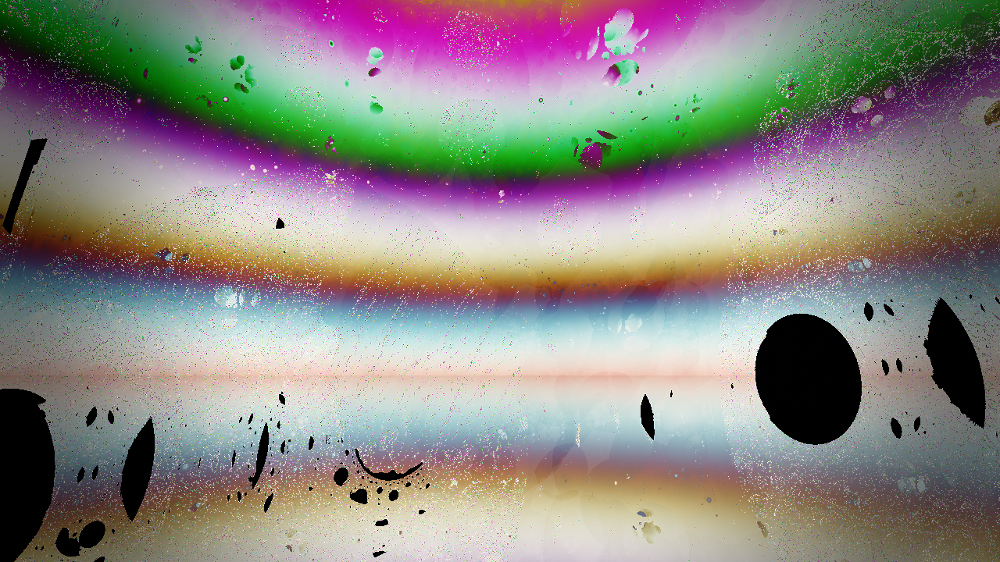
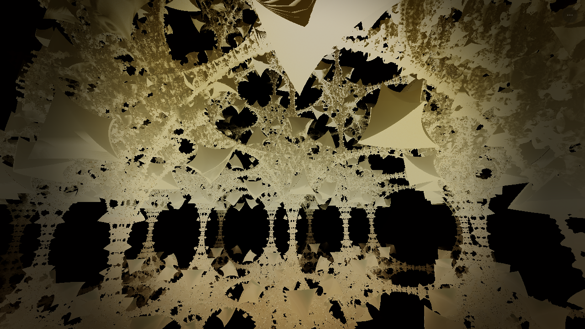
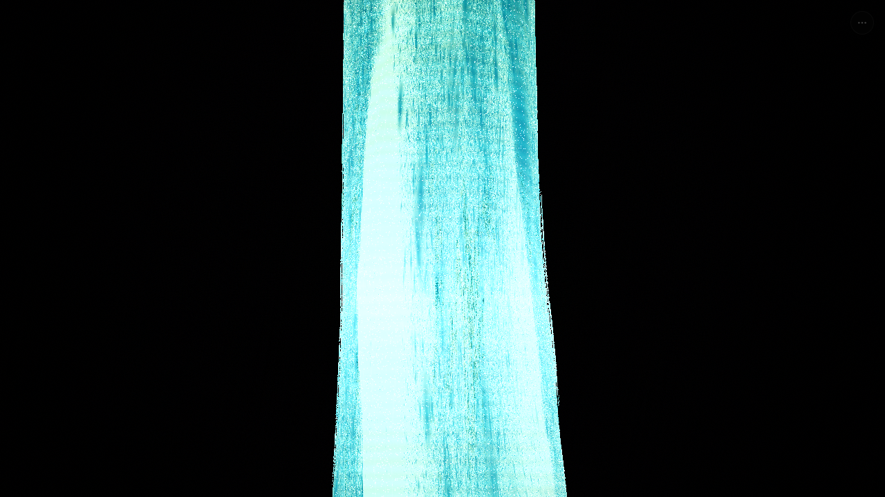
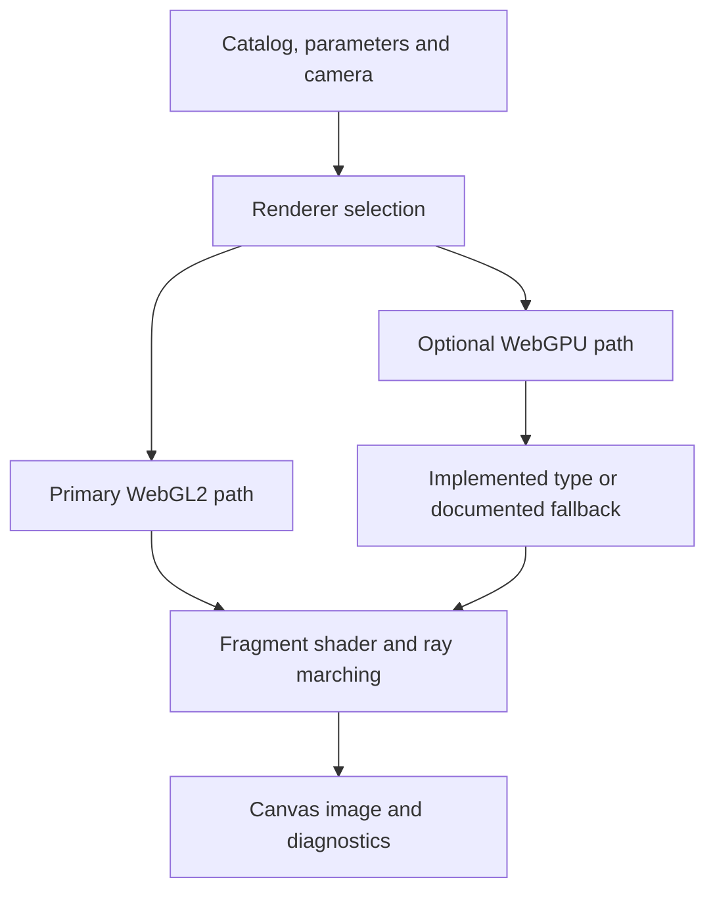

<div align="center">

# Golden Ratio Fractal Engine

**Mathematical worlds. Light, colour and motion.**

Interactive fractals · WebGL2 · Optional WebGPU · Palettes and ambient audio

[Interactive site](https://fractal.simundis.com/) · [Try a session](#try-a-session) · [Gallery](#project-gallery) · [Run locally](#run-locally) · [Agent entry](../AGENTS.md)

</div>



A browser-based fractal explorer built with **React, TypeScript and Vite**. Move through mathematical forms, adjust their visual treatment and inspect the rendering architecture behind the scene.

## Try a session

**Explore a form.** Open the interactive site or the local application, start with WebGL2 and choose a fractal from the catalog. Try camera movement before changing scene parameters.

**Shape the image.** Compare a palette and rendering-style change on the same form. Then explore another catalog entry, the atlas and information overlays. Ambient audio is optional.

**Compare deliberately.** Use WebGPU only where the selected browser/device supports it. Its type coverage differs from WebGL2: a fallback is not evidence of equivalent rendering. Keep renderer, preset and resolution with any comparison.

This is a suggested demonstration route, not a record that these interactions were rerun during the README update. The site is the project's documented deployment address; the current deployment revision is not established here.

## Project gallery

These are **existing repository illustrations**, not newly captured application screenshots or benchmark evidence. Open an image to inspect its original asset.

### Apollonian

[](assets/gallery-apollonian.png)

### Holographic gyroid

[](assets/gallery-gyroid-holo.png)

More existing assets: [Quasicrystal](assets/gallery-quasicrystal.png) · [Hofstadter butterfly](assets/gallery-hofstadter.png).

Only two gallery images are embedded in addition to the hero. Original PNGs remain unchanged; their display width does not reduce their download size. New captures should have documented provenance and appropriately optimized web copies.

## Two renderers, different coverage

| Backend | Role | Documented type coverage |
| --- | --- | --- |
| **WebGL2** | Primary rendering path. | 431 types. |
| **WebGPU** | Optional rendering path. | 131 of 431 types; remaining types use the documented phyllotaxis fallback. |

The documented catalog offers 10 rendering styles. Exact coverage belongs to the catalog and [rendering contract](../RENDERING_SYSTEM.md), not a permanent performance badge. Both backends use fragment-shader ray marching, not compute-shader implementations.



This is a conceptual navigation diagram. See [ARCHITECTURE.md](../ARCHITECTURE.md) for the implementation map and inspect current source before changing either backend.

## Run locally

From the repository root, with Node.js and npm available:

```sh
git clone https://github.com/bouncemonster/swype-imagine.git
cd swype-imagine
npm ci
npm run dev -- --host 127.0.0.1
```

Open `http://127.0.0.1:3000/` using the actual startup output. The explicit host keeps the session on loopback; the unmodified dev script binds to all interfaces.

For a production bundle and local preview:

```sh
npm run build
npm run preview -- --host 127.0.0.1
```

Use the preview address printed by Vite. A local preview is not a Cloudflare deployment.

## Verify and hand off

Read [AGENTS.md](../AGENTS.md) before editing. It now points to the existing architecture document and distinguishes the actual test lanes. Use GitHub `bouncemonster/swype-imagine/main`, preserve other agents' local work and checkpoint the source revision, changed files, checks and one next action before switching IDEs.

<details>
<summary><strong>Declared verification commands</strong></summary>

| Command | Purpose |
| --- | --- |
| `npm run lint` | TypeScript checking with `tsc --noEmit`. |
| `npm run build` | Production bundle. |
| `npm run test:unit` | Mapper, shader-math and cross-engine parity tests. |
| `npm run test` | Integration autotest. |
| `npm run test:headless` | Headless fractal tests. |
| `npm run test:browser` | Browser tests. |
| `npm run test:mobile` | Mobile/coarse-pointer design audit. |
| `npm run test:benchmark` | Performance benchmark. |
| `npm run test:all` | Unit, integration, headless, benchmark and quality scripts. |

**`test:all` does not include the browser or mobile scripts, or the production build.** Run the relevant additional lanes separately. Browser/GPU checks need their configured environment; an unavailable lane is NOT RUN, not PASS.

</details>

For a new visual demonstration, record source commit, selected fractal/preset, renderer, resolution, browser/device and paused/animated state. Historical assertion totals, bundle sizes and audit images remain snapshots, not proof of the current revision.

## Find the right document

| Task | Reference |
| --- | --- |
| Understand implementation | [Architecture](../ARCHITECTURE.md) · [Rendering system](../RENDERING_SYSTEM.md) · [Technical documentation](../TECHNICAL_DOCS.md). |
| Work on presentation | [Design](../DESIGN.md) · [Design QA](../design.qa.yaml). |
| Explore the product and mathematics | [Catalog](../PRODUCT_CATALOG.md) · [Whitepaper](../WHITEPAPER.md) · [Technical handbook](../README.md). |
| Resume or contribute | [Agent entry](../AGENTS.md) · [PR checklist](pull_request_template.md) · [Documentation directory](../docs/). |
| Handle security or community matters | [Security](SECURITY.md) · [Code of conduct](CODE_OF_CONDUCT.md). |

`npm run deploy:cf` publishes to Cloudflare after building and requires separate deployment authorization. Documentation work does not run it. Released under the existing [MIT License](../LICENSE).

---

### По-русски

**Исследуйте форму, меняйте свет и палитру, сравнивайте результат.** Это интерактивный фрактальный движок, основной путь которого — WebGL2; WebGPU поддерживает часть каталога.

Галерея показывает существующие иллюстрации проекта, не новые снимки работающего интерфейса. Для разработки и передачи задачи другой IDE начните с [AGENTS.md](../AGENTS.md). Полное русскоязычное описание, каталог и история измерений сохранены в [техническом руководстве](../README.md).
