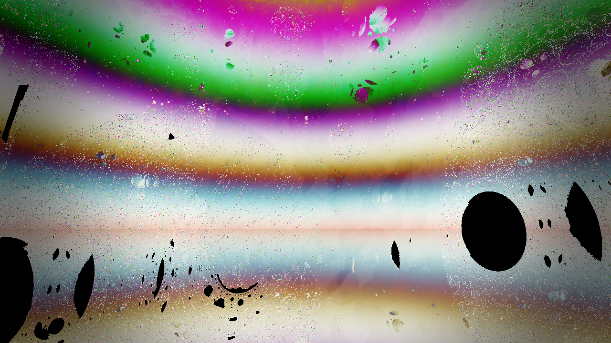
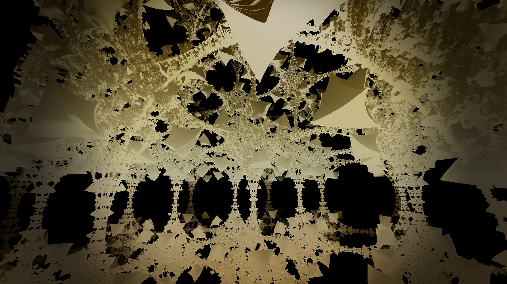
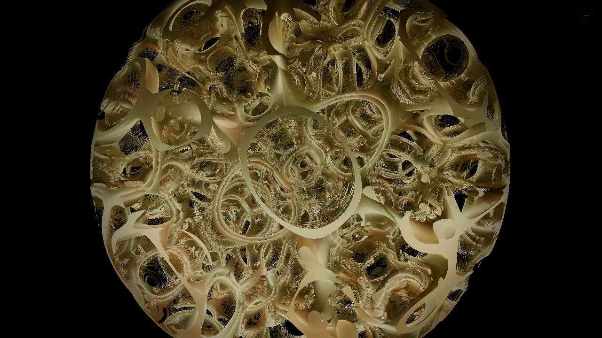
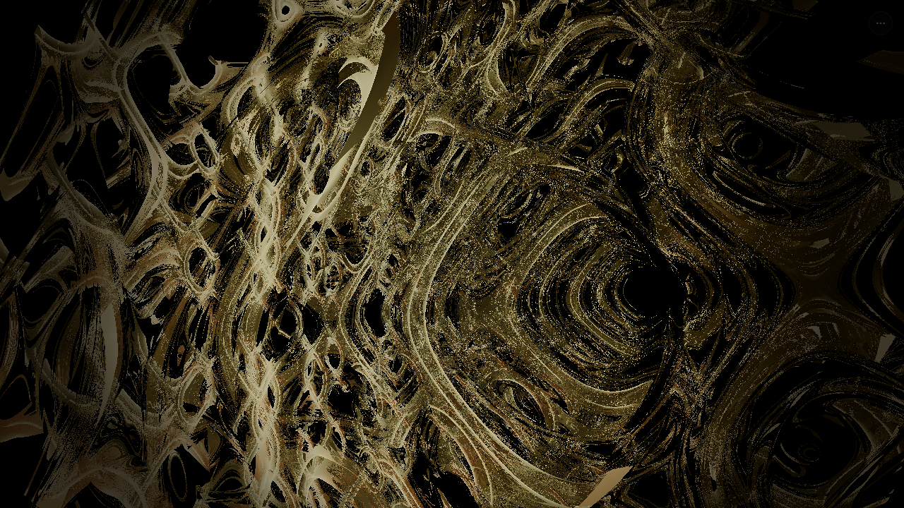
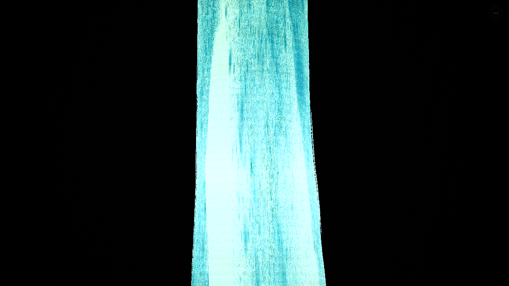

# Golden Ratio WebGPU Fractal Engine

<p align="center">
  
</p>

<p align="center">
  <a href="https://fractal.simundis.com/"></a>
  <a href="https://github.com/bouncemonster/swype-imagine/actions/workflows/ci.yml"></a>
  <a href="LICENSE"></a>
  
  
  
  
</p>

**431 fractal types** (141 core + 290 variants) rendered in real time on WebGL2 with an
optional WebGPU path. A single distance evaluator (`map*` + `ray march`) drives signed-distance
fractals, adaptive quality, and ten render styles. Ships always-on at Cloudflare Pages with a
personalization engine that learns from interaction.

🌐 **Live demo**: https://fractal.simundis.com/  ·  **Mirror**: https://golden-ratio-fractal-engine.pages.dev/
📚 **Docs**: [`docs/`](./docs) · [`DESIGN.md`](./DESIGN.md) · [`ARCHITECTURE.md`](./ARCHITECTURE.md) · [`CHANGELOG.md`](./docs/CHANGELOG.md)

---

## Gallery

| Apollonian gasket | Quasicrystal | Hofstadter butterfly | Gyroid (hologram) |
|:---:|:---:|:---:|:---:|
|  |  |  |  |

Screenshots captured by `tests/visual-snapshot-sweep.ts` at 1280×720 from the shipping bundle.

## 🚀 Возможности

- **431 типов фракталов**: 141 core (индексы 0-140: Mandelbulb, Mandelbox, Menger, polytopes, Mandelbrot variants) + 290 вариантов (141-430: Julia, IFS, L-System, Flame, Hybrid)
- **Двойной бэкенд**: WebGL2 (основной, все 431 типов) + WebGPU (опциональный, 131/431) с fallback на WebGL2
- **Ray Marching**: GLSL 256/192/128 шагов по дистанции × quality-множитель (0.5-1.0); WGSL 512/384/256; до 64 итераций фрактала
- **Адаптивный рендеринг**: LOD, space leaping, early termination
- **Продвинутое освещение**: Soft shadows, SSS, environment reflections, bounce light, god rays, motion blur
- **10 режимов рендеринга**: Solid PBR, X-Ray, Topography, Hologram, Iridescent, Quantum, Crystal, Wireframe, Heatmap, Neon
- **666 палитр**: 26 ручных (palettes.ts) + 640 процедурных (80 тем × 8), Harmonic cosine palette system с φ-сдвигами
- **Интерактивность**: Вращение, zoom, морфинг в реальном времени
- **Keyboard shortcuts**: 1-9 + 0 (режимы), F (камера), R (сброс), I (инерция), S (стоп)
- **Аудио**: φ-tuned ambient audio engine (Web Audio API)
- **Type Safety**: 0 ошибок TypeScript (strict mode ✅ включён), типизация всех 431 типов
- **Lazy Shader Compilation**: Модульная архитектура предотвращает краши браузера (введена в v2.4.0, доработана к v6.0.0)
- **Прогресс-загрузка**: CosmicLoader следует реальному прогрессу компиляции шейдеров (parsing 10% → compiling 40% → linking 80% → complete 100%) и скрывается на первом отрисованном кадре
- **Тестирование**: 718 unit-ассертов (524 mapper + 113 shader-math + 81 engine-parity) + 1875 integration-ассертов (autotest) + 477 headless + browser tests — все зелёные
- **Перформанс загрузки**: 458 KB → **283 KB** boot `index` chunk (−38 %) за React.lazy ControlsPanel + 4 closed modals, immutable cache headers, CSS-only pre-paint splash. Подробности в [`docs/PERF_AUDIT-2026-09-23.md`](./docs/PERF_AUDIT-2026-09-23.md).

## 📦 Установка и запуск

```bash
# Установка зависимостей
npm install

# Development server (http://localhost:3000)
npm run dev

# Production build
npm run build

# Deploy to Cloudflare Pages
npm run deploy:cf

# Запуск тестов
npm run test:unit      # Unit tests (718 assertions)
npm run test           # Integration tests (1875 assertions)
npm run test:browser   # Playwright browser tests
npm run test:mobile    # Responsive/tap-target audit (coarse-pointer emulation)
npm run test:all       # Full test suite
npm run lint           # TypeScript type check
```

## 🏗️ Архитектура

```
src/
├── shaders/
│   ├── webglShaders.ts       # GLSL ES 3.0 шейдеры (161KB, 4195 lines) — dispatch всех 431 типов
│   │   ├── VERTEX_SHADER_SOURCE (L63) + алиас GLSL_VERTEX_SHADER
│   │   ├── FRAGMENT_SHADER_SOURCE (L74-4193) — монолитный исходник: uniforms, map* функции, evalSingleFractal, sceneSDF, main()
│   │   └── GLSL_FRAGMENT_SHADER (алиас)
│   ├── webgpuShaders.ts      # WGSL шейдеры (158KB, 4069 lines) — 131/431 типов (0-130), 131-430 → phyllotaxis fallback
│   └── modules/              # 5 модулей вариаций + index.ts
│       ├── juliaVariations.ts    # Julia вариации 141-190 (110 lines, 6.3KB)
│       ├── ifsVariations.ts      # IFS вариации 191-240 (115 lines, 6.3KB)
│       ├── lsystemVariations.ts  # L-System вариации 241-290 (130 lines, 7.1KB)
│       ├── flameVariations.ts    # Flame вариации 291-340 (114 lines, 6.2KB)
│       ├── hybridVariations.ts   # Hybrid вариации 341-430 (180 lines, 12KB)
│       └── index.ts              # Ре-экспорт 5 variation-блоков (18 lines)
├── engine/
│   ├── WebGLEngine.ts        # WebGL2 рендерер (23KB, 523 lines)
│   ├── WebGPUEngine.ts       # WebGPU рендерер (8.7KB, 238 lines)
│   ├── ShaderManager.ts      # Lazy минимальная сборка шейдера + LRU cache (15KB, 327 lines) ⭐ введена в v2.4.0
│   ├── FractalEngineBase.ts  # Базовый класс (9.6KB, 220 lines)
│   ├── fractalMappers.ts     # Маппинги типов (22KB, 577 lines, 451 имя → 431 индекс)
│   ├── NeuroAestheticsEngine.ts # AI эстетика (44KB, 1112 lines)
│   ├── RenderDiagnostics.ts     # Диагностика (6.8KB, 262 lines)
│   ├── MathValidation.ts        # Валидация математики (1.5KB, 58 lines; вне render-путей)
│   └── UserProblemLogger.ts     # Логирование проблем (6.9KB, 238 lines)
├── components/
│   ├── FractalCanvas.tsx     # GPU canvas + interaction (10KB, 269 lines)
│   ├── ControlsPanel.tsx      # UI контролы (43KB, 873 lines) — React.lazy
│   ├── TelemetryHUD.tsx      # FPS/draw-call overlay (7.6KB, 171 lines)
│   ├── FractalInfoHUD.tsx    # Информация о фрактале (17KB, 389 lines)
│   ├── FractalScrollFeed.tsx # Горизонтальный браузер (12KB, 281 lines)
│   ├── FractalAtlasModal.tsx # Модальное окно атласа (33KB, 574 lines) — React.lazy + 95 KB catalog
│   ├── FractalProbeHUD.tsx   # Probe overlay (5.5KB, 128 lines)
│   ├── ExplanationModal.tsx  # Модальное окно объяснений (16KB, 207 lines) — React.lazy
│   ├── UserProfileModal.tsx  # Профиль пользователя (18KB, 363 lines) — React.lazy
│   ├── ProjectManifestModal.tsx # Манифест проекта (8.5KB, 176 lines) — React.lazy
│   ├── CosmicLoader.tsx      # Прогресс-загрузка (6.9KB, 180 lines)
│   └── DebugOverlay.tsx      # Debug overlay (6.6KB, 158 lines)
├── hooks/
│   └── useRenderEngine.ts    # Render engine lifecycle + loadProgress (33KB, 781 lines)
├── data/
│   ├── canonicalFractals.ts  # Каталог фракталов (1.4KB, 31 lines)
│   ├── fractalCatalogTypes.ts # Типы каталога (4.1KB, 115 lines)
│   ├── fractalFactory.ts     # Фабрика фракталов (2.4KB, 86 lines)
│   ├── compatibleHybrids.ts  # Матрица совместимости гибридов (16KB, 250 lines)
│   ├── fractalArchitectures.ts # Данные архитектуры (7.7KB, 194 lines)
│   └── categories/           # 11 category files (10 FractalCategoryKey, 145 каталожных записей)
│       ├── geometricCurves.ts       # Геометрические кривые (16KB, 298 lines)
│       ├── constructiveFractals.ts  # Конструктивные фракталы (8.6KB, 182 lines)
│       ├── algebraicFractals.ts     # Алгебраические фракталы (12KB, 210 lines)
│       ├── multidimensionalFractals.ts # Многомерные (3.9KB, 96 lines)
│       ├── ifsFractals.ts           # IFS фракталы (6.8KB, 152 lines)
│       ├── stochasticFractals.ts    # Стохастические (4.2KB, 113 lines)
│       ├── physicalFractals.ts      # Физические (6.5KB, 152 lines)
│       ├── expandedRealFractals.ts  # Расширенные реальные (8.1KB, 250 lines)
│       ├── visuallyDistinctFractals.ts # Визуально различные (6.7KB, 162 lines)
│       ├── mandalas3D.ts            # 3D Мандалы (13KB, 313 lines)
│       └── temporalManifolds.ts     # Временны́е многообразия (12KB, 307 lines)
├── audio/
│   └── goldenAudio.ts        # φ-tuned ambient audio (22KB)
├── types/
│   └── fractal.ts            # TypeScript интерфейсы (33KB, 576 lines)
├── palettes.ts               # Цветовые палитры — 26 ручных (7.6KB, 212 lines)
├── palettesProcedural.ts     # Процедурные палитры — 640 (80 тем × 8) (3.3KB, 89 lines)
├── App.tsx                   # Главный компонент (30KB, 717 lines)
└── main.tsx                  # Точка входа (725B, 18 lines)
```

**Total**: 73 TypeScript/TSX files (54 src + 19 tests), ~935 KB src source code.

## 🎨 Типы фракталов (431 total = 141 core + 290 variants)

| Категория | Количество | Диапазон | Примеры |
|-----------|------------|----------|--------|
| **Classic Fractals** | 131 | 0-130 | Mandelbulb, Mandelbox, Menger, Sierpinski, Tesseract, Klein Bottle |
| **Mandelbrot Variations** | 10 | 131-140 | Power 3-12, Multibrot |
| **Julia Variations** | 50 | 141-190 | Quaternion Julia, c-варианты |
| **IFS Variations** | 50 | 191-240 | Kaleidoscopic IFS, dragon curve |
| **L-System Variations** | 50 | 241-290 | Рекурсивное ветвление, Lindenmayer |
| **Flame Variations** | 50 | 291-340 | Sinusoidal, Spherical, Swirl |
| **Hybrid Variations** | 90 | 341-430 | Mandelbrot-Julia, IFS-Flame |
| **Total** | **431** | 0-430 | 141 core (0-140) + 290 вариантов (141-430); WebGL рендерит все 431 |

## ⚡ Производительность

| Параметр | Значение |
|----------|----------|
| **Max Raymarch Steps** | GLSL 256 (close) / 192 (medium) / 128 (far) × qualityMult; WGSL 512/384/256 |
| **Max Iterations** | 64 (clamp 6-64, адаптивно по типу) |
| **Zoom Range** | 0.01 - 100.0 |
| **AO Probes** | GLSL 7 samples + 4 distances (WGSL 5 + 3) |
| **Hit Threshold** | max(max(cam_dist * 0.0003, 0.0001) * 3.0, 0.002) |
| **SDF Calls/Pixel** | ~170-270 (with all effects) |
| **Boot `index` chunk** | 283 KB decoded / 88 KB brotli (from 458 KB pre-perf) |

## 🛠️ Технологии

- **Frontend**: React 19 + TypeScript 5.8 (strict) + Vite ^6.2.3
- **Styling**: Tailwind CSS v4 (oklch tokens; brand aliases in `src/index.css`)
- **Rendering**: GLSL ES 3.0 (WebGL2) / WGSL (WebGPU)
- **Deploy**: Cloudflare Pages via Wrangler; named tunnel for `fractal.simundis.com`
- **Build**: Bun/npm
- **Testing**: Playwright + custom harness — 718 unit + 1875 integration + 477 headless assertions
- **CI**: GitHub Actions (`.github/workflows/ci.yml`): typecheck → build → unit trio → autotest → mobile design audit

## 🧪 Тестирование

| Suite | Assertions | Description |
|-------|------------|-------------|
| **fractal-mapper-test** | 524 | Index mapping completeness, aliases, render styles, composite ops, camera modes |
| **shader-math-validation-test** | 113 | Division-by-zero guards, NaN protection, color mixing, SDF properties, uniform consistency |
| **cross-engine-parity-test** | 81 | WebGL/WebGPU uniform packing, draw calls, fallback, quality levels |
| **fractal-autotest** | 1875 | SDF functions, palettes, render styles, audio, share links |
| **mobile-design-audit** | gate | 44 px tap targets, 12 px text floor, `env(safe-area-inset-*)`, zero horizontal overflow — coarse-pointer forced via CDP `Emulation.setEmulatedMedia` |
| **Browser tests** | Visual | Playwright + Chromium visual regression, coverage stats for animated renders |

## 🤝 Community

- Contributions welcome — read [`docs/CONTRIBUTING.md`](./docs/CONTRIBUTING.md) and use the [issue templates](./issues/new/choose) or the [PR template](./.github/pull_request_template.md).
- By participating you agree to the [Contributor Covenant 2.1 Code of Conduct](./.github/CODE_OF_CONDUCT.md).
- Dependency and Actions updates are automated by [Dependabot](./.github/dependabot.yml).

## 📜 License

[MIT](LICENSE) — free for research and commercial use.

---

**Built with ❤️ for the fractal community**

<sub>
Repo: <a href="https://github.com/bouncemonster/swype-imagine">bouncemonster/swype-imagine</a> ·
Local git root: <code>J:\project\swype-imagine\app</code> ·
Last updated: September 2026
</sub>
