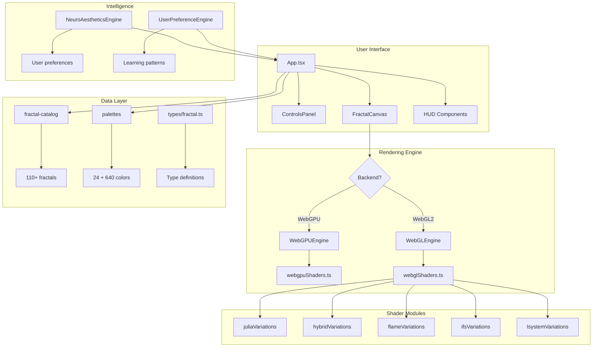
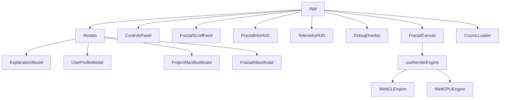
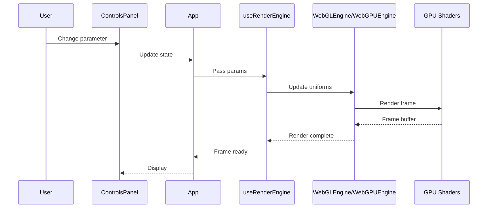
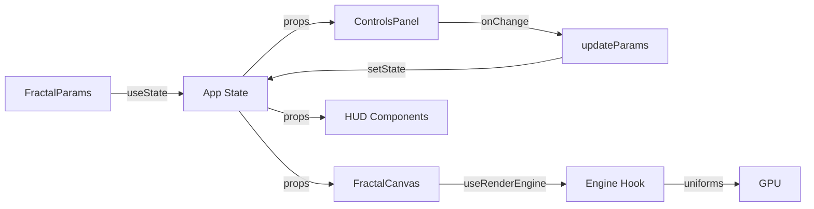
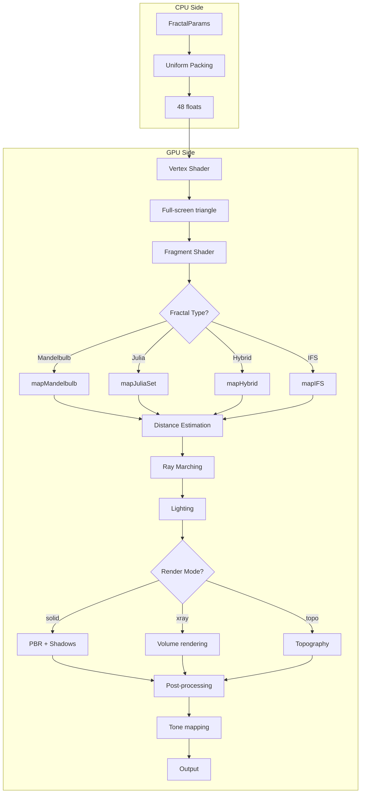
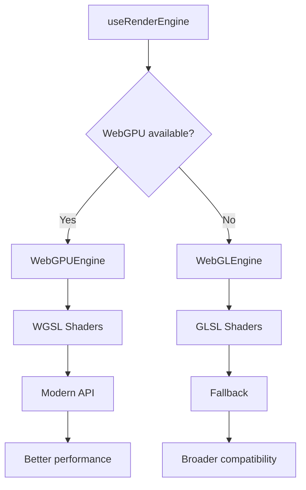
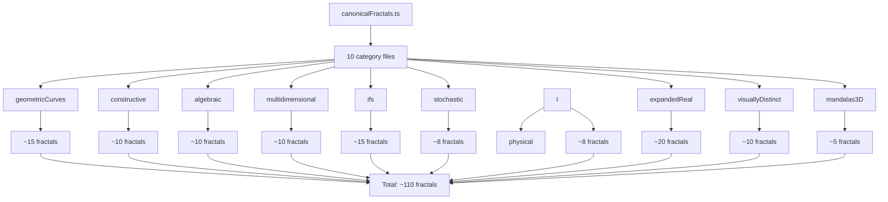
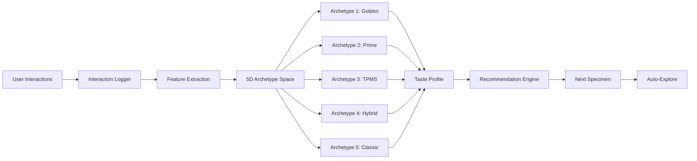
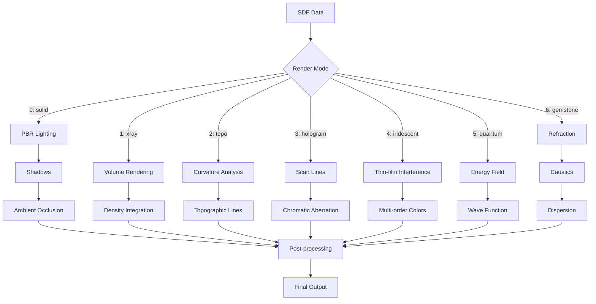
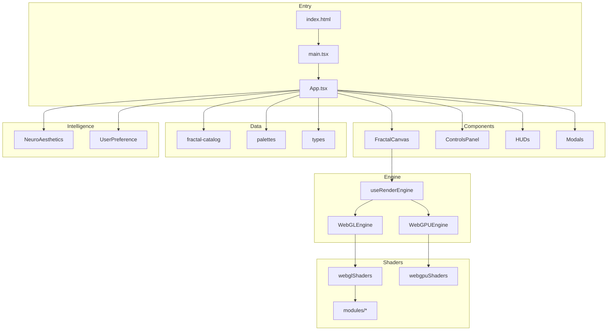

# Architecture Diagrams

## System Overview



## Component Hierarchy



## Data Flow



## State Management



## Shader Pipeline



## Engine Selection



## Fractal Catalog System



## Neuro-Aesthetics Engine



## Render Mode Pipeline



## Uniform Buffer Layout

```
┌─────────────────────────────────────────┐
│  [0-1]   resolution: vec2<f32>          │
│  [2]     time: f32                      │
│  [3]     phi_val: f32                   │
├─────────────────────────────────────────┤
│  [4-5]   cam_rot: vec2<f32>             │
│  [6]     zoom: f32                      │
│  [7]     fractal_type: f32              │
├─────────────────────────────────────────┤
│  [8]     iterations: f32                │
│  [9]     glow_intensity: f32            │
│  [10]    morph_speed: f32               │
│  [11]    hybrid_type: f32               │
├─────────────────────────────────────────┤
│  [12]    hybrid_blend: f32              │
│  [13]    box_fold: f32                  │
│  [14]    sphere_fold: f32               │
│  [15]    interior_cut: f32              │
├─────────────────────────────────────────┤
│  [16-18] primary_color: vec3<f32>       │
│  [19]    tertiary_type: f32             │
├─────────────────────────────────────────┤
│  [20-22] secondary_color: vec3<f32>     │
│  [23]    tertiary_blend: f32            │
├─────────────────────────────────────────┤
│  [24-26] accent_color: vec3<f32>        │
│  [27]    compose_op: f32                │
├─────────────────────────────────────────┤
│  [28]    smooth_k: f32                  │
│  [29]    warp_strength: f32             │
│  [30]    octave_layers: f32             │
│  [31]    cam_mode: f32                  │
├─────────────────────────────────────────┤
│  [32-34] cam_pos: vec3<f32>             │
│  [35]    slice_plane: f32               │
├─────────────────────────────────────────┤
│  [36]    headlamp_power: f32            │
│  [37]    volumetric_fog: f32            │
│  [38]    slice_axis: f32                │
│  [39]    render_style: f32              │
├─────────────────────────────────────────┤
│  [40-42] ambient_color: vec3<f32>       │
│  [43]    palette_seed: f32              │
├─────────────────────────────────────────┤
│  [44]    palette_rotation: f32          │
│  [45-47] pad5: vec3<f32>                │
└─────────────────────────────────────────┘
Total: 48 floats (192 bytes)
```

## File Dependencies


